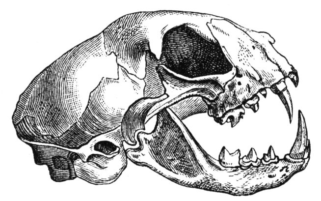

# First section

Load some packages, do some analysis, generate some plots...


```{python}
import pandas as pd
import matplotlib.pyplot as plt
import os
print(os.getcwd())
```

## Get parameters from papermill/knitr

The following setup allows to run the parametrized report with both rmarkdown and papermill:

* We first try to get the results `r.params` through reticulate. (default parameters are defined in the YAML header)
* If that fails, we use the papermill notation to define default parameters.
* the cell needs to be tagged with `parameters` (see metadata)

```{python tags=c("parameters")}
# get default parameters. Either papermill or rmarkdown way.
try:
    input_file = r.params["input_file"]
except:
    print("Could not access params from `r` object. Don't worry if your are running papermill. ")
    input_file = "../results/01_generate_data/iris.tsv"
```

# Second section

## The following code block is shows both code and results.
```{python}
# TEST: ECHO_TRUE_01
print("TEST: " + "_".join(("RESULTS", "SHOW", "01")))
```

## The following code block is hidden (code and results).
Define a function to compute the fibonacci sequence.
```{python, include=FALSE}
# TEST: ECHO_FALSE
print("TEST: " + "_".join(("RESULTS", "HIDE")))
# define fibonacci function
# source: https://dev.to/teosoft7/how-to-implement-fibonacci-sequence-with-python-4cfo
def fib(num):
    if num == 0:
        return 0
    elif num == 1 or num == 2:
        return 1
    elif num > 2:
        a = 1 # variable for (n - 1)
        b = 1 # variable for (n - 2)
        for _ in range(3, num + 1):
            c = a + b
            a, b = b, c

        return c

print("Fibonacci number 42: " + str(fib(42)))
```

## The following code block is hidden (hide code, show results).

Show the first 10 fibonacci numbers:
```{python echo=FALSE}
# TEST: ECHO_FALSE
print("TEST: " + "_".join(("RESULTS", "SHOW", "02")))
for i in range(10):
    print("The {i}th Fibonacci number is {f}".format(i=i, f=fib(i)))

plt.plot(range(10), [fib(x) for x in range(10)])
```


## The following code block suppresses the results:
```{python results='hide'}
# TEST: ECHO_TRUE_02
print("TEST: " + "_".join(("RESULTS", "HIDE")))
for i in range(10):
    print("The {i}th Fibonacci number is {f}".format(i=i, f=fib(i)))

plt.plot(range(10), [fib(x) for x in range(10)])
```


# Summary
Every notebook should hava summary section that's understandable by biologists.
Include the 'highlights' here and repeat the corresponding figures.

```{python echo=FALSE}
iris = pd.read_csv(input_file, sep="\t")
print(iris)
```

... And here is a cat skull included from the resource dir. Pandoc should include it in the HTML


